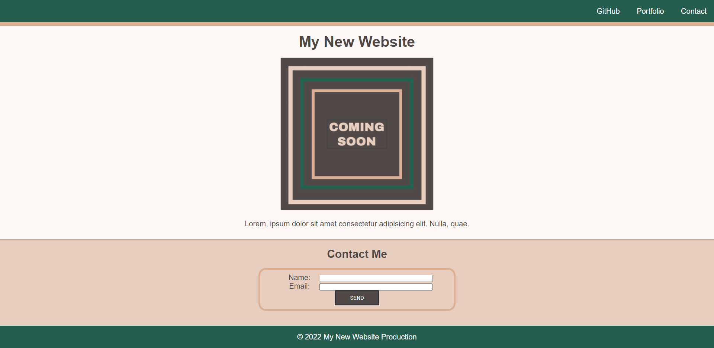

# Module-01 MiniProject: Landing Page

## Description
A landing page has been built using HTML and CSS.
- Uses semantic HTML elements.
- Uses universal, element and class selectors in CSS.
- Webpage features three colors in design.
- Header is fixed to the top of the page.

## Deployment
The webpage is deployed to GitHub pages. Use below link to visit the webpage: https://nileshpatel83.github.io/Module01-MiniProject/

## Screenshot

## License
Please refer to the LICENSE in the repo.